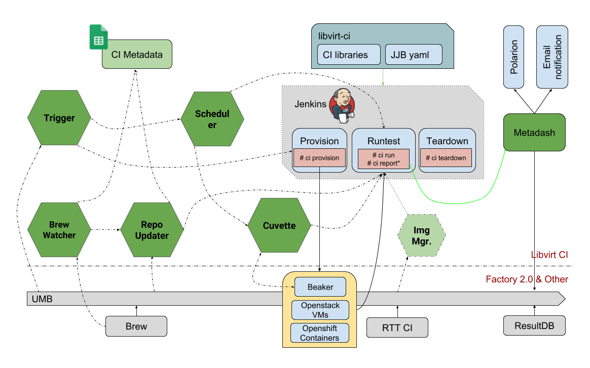

LIBVIRT CI
==========

What is it?
-----------

libvirt CI is a project that provides essential libraries and helper commands
that making Continuous Integration (CI) of libvirt related projects possible.

The libraries offer features:
 - parse, check, update jobs from JJB yaml files
 - jenkins slave provisioning with beaker and openstack vms
 - test env preparing with packages, repo, images, conf, test runner, etc.
 - run tests with specific test runners
 - report test result to test management system
 - group and report failure to JIRA
 - publish and receive messages to message bus
 - bug monitoring via teiid and report to JIRA
 - update remote yum repo
 - monitor and update caselink
 - build images and upload to stroage server

This project also manages Jenkins configuration files compatible with Jenkins
Job Builder.

libvirt CI revolves around Jenkins, but also offer utility commands which
could be used independently, it could be installed as a stand alone package.

Architecture
------------

Currently libvirt CI have move to Microservices Architecture and libvirt-ci
project as part of it.

The architecture view as:

   Libvirt CI Overview 0.0.2

All the services project could be found in:
https://gitlab.cee.redhat.com/libvirt-auto/

Latest doc please check:

https://url.corp.redhat.com/libvirt-ci
