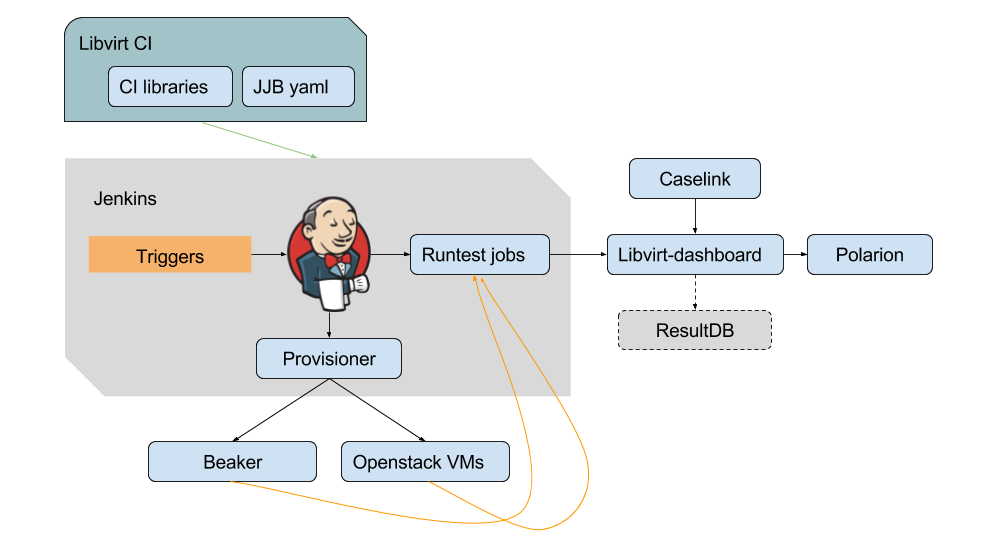
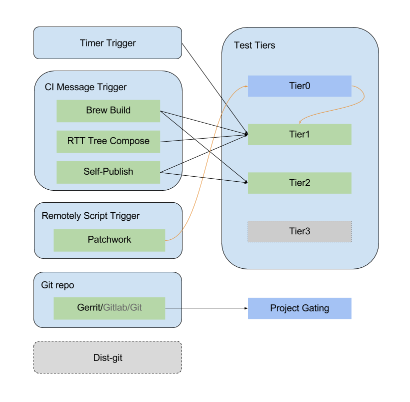

Intro
*****

libvirt CI is a project that provides essential libraries and helper commands
that making Continuous Integration (CI) of libvirt related projects possible.

The libraries offer features:
 - parse, check, update jobs from JJB yaml files
 - jenkins slave provisioning with beaker and openstack vms
 - test env preparing with packages, repo, images, conf, test runner, etc.
 - run tests with specific test runners
 - report test result to test management system
 - group and report failure to JIRA
 - publish and receive messages to message bus
 - bug monitoring via teiid and report to JIRA
 - update remote yum repo
 - monitor and update caselink
 - build images and upload to stroage server

This project also manages Jenkins configuration files compatible with Jenkins
Job Builder.

libvirt CI revolves around Jenkins, but also offer utility commands which
could be used independently, it could be installed as a stand alone package.

Architecture
============

Integration View
----------------

   Libvirt CI Overview 0.0.1

The latest CI Microservices architecture is still under delveloping, while
part of the services have been deployed and relieved Jenkins from workload
and logic handling.

With current libvirt-ci 0.0.2 version, architecture evolved as:

.. figure:: images/libvirt_ci_architecture_0.0.2.png
   :align:  center

   Libvirt CI Overview 0.0.2

As show on the diagram, some functionalities have been moved out of
libvirt-ci or created in new repos as services.

New services include:

  1. `Trigger <https://gitlab.cee.redhat.com/libvirt-auto/job-trigger>`_

     The trigger service watching message bus also offer rest API for
     select and trigger jenkins jobs.

  2. `Repo Updater <https://gitlab.cee.redhat.com/libvirt-auto/repo-updater>`_

     The package repo updater service which watch message bus and update
     repo servers for CI consume.

  3. `Metadash <https://github.com/ryncsn/metadash>`_

     The UI dashboard for (meta)data managing, data aggregating, and data
     gateway, flexiable design with plugins and good performance.

  4. `Brew Watcher <https://gitlab.cee.redhat.com/libvirt-auto/brew-watcher>`_

     Brew watcher is a service project watching brew hub for build info and
     notify end users or other services via rest API.

  5. `Cuvette <https://gitlab.cee.redhat.com/libvirt-auto/cuvette>`_

     Machine pool services against beaker, offer rest API for request machines
     from beaker and keep in pool for reduce queuing and reinstallation time.

  6. `Scheduler <https://gitlab.cee.redhat.com/libvirt-auto/scheduler>`_

     Job scheduler of Libvirt CI microservices framework, which cache jobs
     info and query Cuvette against beaker machines for scheduling jobs to
     run and switch nodes automatically.

While Img Manager still remain on Jenkins as pipeline jobs due to dependency
on bare metal machines, the other services are running in containers and
deployed on Openshift.

CI Metadata currently managed via Google Spreedsheet with interface exposed
to both human and other service through Google oAuth APIs.

Trigger View
-------------

   Libvirt CI Trigger Overview

.. note:: The line in dots indicate not yet implemented or supported.

For a glossary of terms, please refer to the :ref:`Glossary` page.
