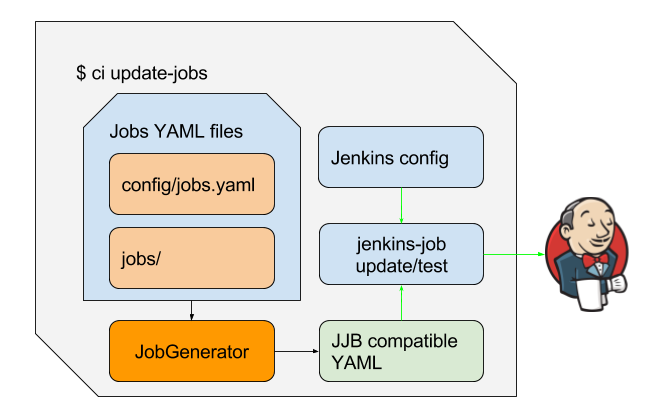

JJB YAML jobs
*************

Jenkins Job Builder
===================
Jenkins Job Builder takes simple descriptions of Jenkins jobs in YAML or JSON
format and uses them to configure Jenkins. Libvirt CI use YAML for jobs
configuration.

For support specific rules in YAML, libvirt ci offer :term:`JJB` wrapper module
to support custom YAML rules.

The custom keyword support added in YAML include:

  * when - borrow from ansible, control flow similar to perl unless
  * exclude - custom for exclude some jobs with the configruation

Other keyword automatically handled include:

  * assignee - assignee with kerberos id for support JIRA and other service
               notify
  * watchers - watchers with kerberos id for support JIRA watchers and other
               service notify
  * trigger-package - support JMS customize and auto generation
  * trigger-by-tree - support JMS customize base on tree compose message
  * dashboard-tags - support auto generate libvirt dashboard tags base on job
                     tags and test feature, dashboard could create tasks in
                     JIRA with the tags

Libvirt CI Jenkins Jobs Generator
---------------------------------

   Libvirt jenkins jobs generator workflow

Jenkins Jobs YAML
=================

As in the jenkins jobs generator figure, YAML jobs under libvirt_ci dir are
majorly two parts::

  * config/jobs.yaml - The testing Metadata for end users
  * data/jobs/ - The dir with jobs config opaque to end users

Libvirt CI Testing Metadata
---------------------------

Libvirt CI testing Metadata is mainly in::

  libvirt_ci/config/jobs.yaml

It contains two major parts:

  * Cartesian sets for specifying the combination axes for generating
    all testing jobs
  * Rules to filtering specific combinations or setting parameter for specific
    condition

This yaml file is exposed to all users for define:

  * what test cases in which test framework for which jobs
  * what parameters for such jobs

.. note:: Pay attention to the comments inside the yaml file.

e.g. libvirt :term:`tp-libvirt` function jobs for memory testing, the config snip:

Cartesian sets (Combinatorial)::

  archs:
      - 'x86_64'
      - 'ppc64le'
      - 'aarch64'
  products:
      RHEL:
          - '6.7'
          - '6.8'
          - '6.9'
          - '7.2'
          - '7.3'
          - '7.4'
      Fedora:
          - '23'
      Pegas:
          - '7.4'
  jobs:
      libvirt:
          - acceptance:
              - general
              - migration
          - function:
              - cpu
              - mem
  ......

Top to down, all combinated together will get the combinatorial jobs. At the
bottom you could find the 'mem' function keyword, and one combinated job could
be::

  libvirt-RHEL-7.4-ppc64le-function-mem

And on jenkins you might find the jobs::

  libvirt-RHEL-7.4-provision-ppc64le-function-mem
  libvirt-RHEL-7.4-runtest-ppc64le-function-mem
  libvirt-RHEL-7.4-teardown-ppc64le-function-mem

The 3 jobs follow the provision, runtest, teardown pipeline.

Now let's see what detailed rules and parameters for the mem jobs::

    - when: test == 'libvirt.function.mem'
      only: |
          virsh.node_memtune
          virsh.memtune
          virsh.setmem
          virsh.setmaxmem
          libvirt_qemu_cmdline.memory_backing
          libvirt_mem
          virsh.edit..edit_memory
      pr: !extend
          - 'tp-libvirt 347,361,570'
      assignee: 'lhuang'
      watchers:
          - jishao
          - ydu
          - weizhan
      feature: 'Memory management'

    - when: test == 'libvirt.function.mem' and arch == 'ppc64le'
    # Reason for configuration replacements:
    # 1) Due to bug 1249006 , some memory values specified will be changed to
    #    align with 256M, which will make the automatic script fail against the
    #    value assertion.
    # 2) The page size on ppc64le is 64K by default instead of 4K on x86_64.
    # 3) The hugepage size on ppc64le is 16M instead of 2M on x86_64.
      replaces: |
          tp-libvirt libvirt/tests/cfg/libvirt_mem.cfg:
              "2560000"-->"2097152"
              "1024000"-->"1048576"
              "512000"-->"524288"
              "1536000"-->"1048576"
              "2609152"-->"2097152"
              "page_size = 4"-->"page_size = 64"
              "2048"-->"16384"
              "0x11f000000"-->"0x40000000"

At the second 'when' snip, it added one 'replaces' parameter with the value for
ppc64le jobs. While for at the first 'when' snip, common parameters for
'libvirt.function.mem' jobs is defined.

.. note:: Libivrt CI will sync config/jobs.yaml with data in Libvirt CI
          Metadata Google sheet, which offer end users more friendly UI for
          maintain test jobs data.

Libvirt CI Structured Jobs Config
---------------------------------

For dig in more on how the jobs put together, need to dive in the dir::

  libvirt_ci/data/jobs/

which not directly for end testing user, but for CI heavy players, while it's
still open to everyone to explore and contribute.

The dir contains:

  * Stand alone YAML jobs::

      projects/jobs_gate.yaml       # Project gating and some services jobs
      projects/repo_updater.yaml    # Remote yum repo server update job

      These stand alone jobs don't need follow provison, runtest, teardown
      pipeline as run on static provisoner jenkins slave.

      Mainly with basic trigger, builder and parameters config.

      Commonly use shell builder with simple run command like 'ci update-repo'

  * Pipeline (workflow) YAML jobs

    The jobs follow provison, runtest, teardown pipeline.

    The :term:`Job Template` for the pipeline::

      provision.yaml
      runtest.yaml
      runtest-static.yaml
      runtest-remote.yaml
      teardown.yaml

    The jobs use the job-template::

      image_builder.yaml
          Build and upload images when got RTT tree compose message

      package_builder.yaml
          virtcov Coverage package build jobs. This will be deprecated with the
          new brew virtcov build workflow with devel.

    **All jobs generated from config/jobs.yaml follow the pipeline and use the
    job-template.**

  * Jenkins config file with jenkins master info::

      config
      local_config
      pjm_config

  * :term:`JJB Macro` dir::

      macros/

        - test-runner.yaml    # Common test runner parameters and builder
        - common/
          - builders.yaml     # Common builders for most jobs
          - parameters.yaml   # Common parameters for most jobs
          - publishers.yaml   # Common publishers for most jobs
          - scms.yaml         # Common source code config for most jobs
          - wrappers.yaml     # Common wrappers for most jobs

  * Raw file dirs::

      only/
          The test cases raw files which will be include as string in yaml

      xml/
        The libvirt xml raw files which will be include as string in yaml

Please check :term:`JJB` docs with macros, job-template, builders, parameters,
publishers, scm, wrappers and pipeline for better understanding.

.. note:: As the project grow, this part have been brought some pain to
   maintain. The plan is to simplify the pipeline which will reduce the jobs
   number and parameters.

Add or Update Jenkins Jobs
==========================

  #. Check and update libvirt CI metadata yaml file
     If you only need add new testing jobs of different product, release,
     arch, test runners.

  #. Add or update in 'jobs' dir
     If you found can't put your test jobs into the libvirt CI metadata yaml
     file ('libvirt_ci/data/jobs'), or you want new service jobs.

