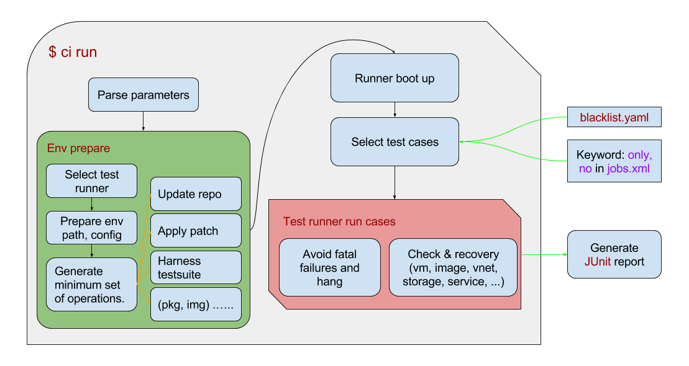
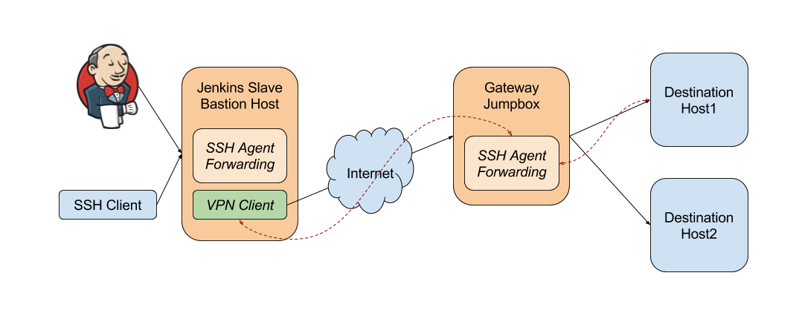
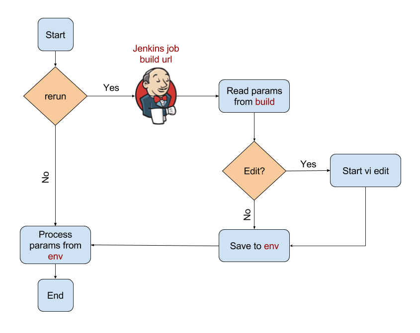

CI Test Runner
**************

Test Runner
===========

The runner dir include all supported test runners::

    libvirt_ci/runner/

Which include::

    avocado_vt.py - avocado-vt test framework
    cimtest.py - libvirt cim test framework
    __init__.py - Module for the runner base class
    install.py - the installation test runner base on libvirt-test-api
    libvirt_tck.py - libvirt-tck test framework for perl-Sys-Virt
    libvirt_unit_test.py - libvirt unit-test
    test_api.py - libvirt-test-api test framework
    virtinst_test.py - test framework for python-virtinst

Libvirt CI will automatically select the test runner for each job base on the
job configs.

Test runner process is a complicated process with:

  * auto selecting test runner
  * setting needed env
  * select test cases
  * run and monitor testing
  * generate report with desired format

Check the test runner workflow:

.. _runner-figure:

   Libvirt CI Test Runner Workflow

Ansible Remote Runner
=====================

By using Ansible API with override Result Callback, now remote runner is
supported. Which run CI commands on source machine while invoke testing on
target machine, while result are collected back aslo with state monitoring
support.

The remote runner could be used against remote labs or cloud destination with
not leaking sensitive data.

Check one working topology illustration below:

.. _ci-ansible-bastion:

   Libvirt CI Remote Test Runner Topology

The workflow is:

   * Ansible SSH Bastion over VPN
   * TestRunner Run on Jenkins Slave
   * Test Framework Invoked by Ansible on Destination
   * CI Control with Data Collect and State Monitoring via Ansible

Currently support only added in avocado-vt runner.

More details please refer to our ansible module and avocado-vt runner module.

Test Rerun
==========

One quite usefull debugging command test runner offer is 'ci rerun', which will
read parameters from the given jenkins job build and rerun the test as same as
in jenkins environment.

The command is::

  # ci run --rerun $jenkins_job_build_url

After read all parameters from jenkins job build, it will ask you to modify the
config with 'vi' if you like, you can update parameters, test cases as you like
then the testing will run localy on the machine where you run the rerun
command.

The rerun option is processed in the 'Parse parameters' step in
:ref:`runner-figure`.

The process of rerun in 'Parse parameters' step:

   CI Test Rerun Process in Parse Parameters

.. note:: Rerun is quite common when debugging jenkins jobs, if you found test
          pass with run directly with test framework on your machine, try with
          rerun to find out whether the CI env bring some variance.

Blacklist for Test Runners
==========================

Blacklist is used for filtering and mark test cases. Jenkins jobs are defined
from JJB YAML, which with detail in next chapter :ref:`JJB YAML jobs`. For the
test cases in the jobs, due to some reasons, they might not fit for some jobs
or there are bugs not gonna fix or not fixed yet.

So we need maintain the data for such situations, which is recorded in the
blacklist yaml file::

  config/blacklist.yaml

The blacklist is for:

  * Filter out test cases with reasons

    The test cases will not be run if skip-test is true.

  * Mark test cases with bugs or other reasons

    Most test cases will be run. Match the error with fail-regex value to mark
    the result in report with bug or reason.

    If one bug have been fixed, the test case will turn from fail to pass and
    no need to be marked in report.

    e.g. One blacklist entrance::

      - test:
          - virsh.vol_create_from
        bug: '1318993'
        skip-test: false
        fail-regex:
          - "error: cannot sync data to file '.*': Input/output error"

    Which means don't filter out the cases 'virsh.vol_create_from', if it
    failed with error match with regex then mark bug
    `1318993 <https://bugzilla.redhat.com/show_bug.cgi?id=1318993/>`_ in the
    report.

    Or if bug fixed and test case run success now, no need mark in the report.

.. note:: Pay attention to the comments in the blacklist.yaml file

.. note:: This part will sync with caselink and could bring change later

.. note:: The functionality is close to WaiverDB + AutoWaiver
